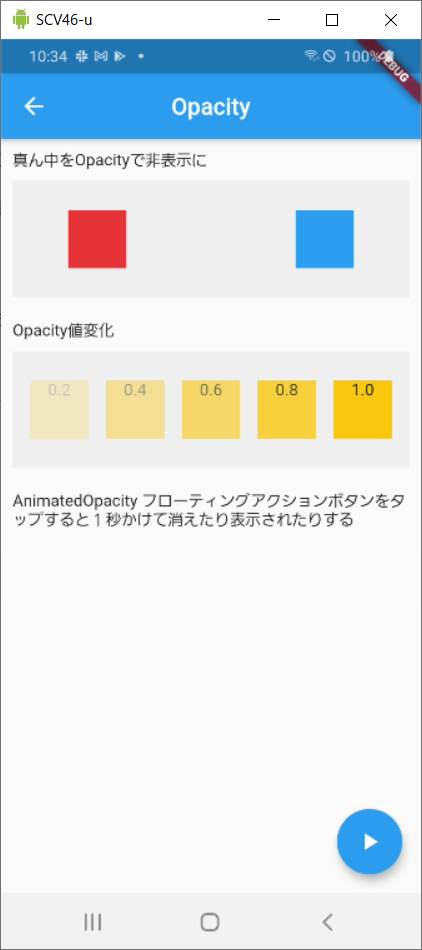
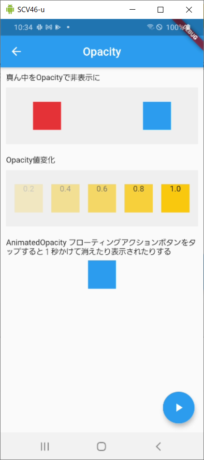

# #5 Opacity

動画：https://www.youtube.com/watch?v=9hltevOHQBw

リファレンス：https://api.flutter.dev/flutter/widgets/Opacity-class.html

## 何をする Widget か？

- Widget の領域を確保、レイアウトを保ちながら、透明にして非表示にできる
- 子を重ねて１つにすることもできる
- AnimatedOpacity ではアニメーションを付けることができる

## 使い方

Opacity でラップし、透明度をセットする。
AnimatedOpacity の場合、duration をセットしてどのくらいの時間で変化するか指定する。

```dart
Opacity(
  opacity: 0,
  child: Container(),
  ),
)
AnimatedOpacity(
  opacity: _opacity,
  duration: Duration(seconds: 1),
  child: Container(),
)
```

## サンプル





## 内部

継承：ImplicitlyAnimatedWidget
