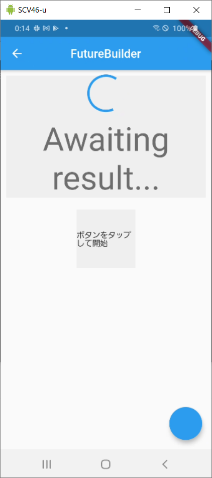
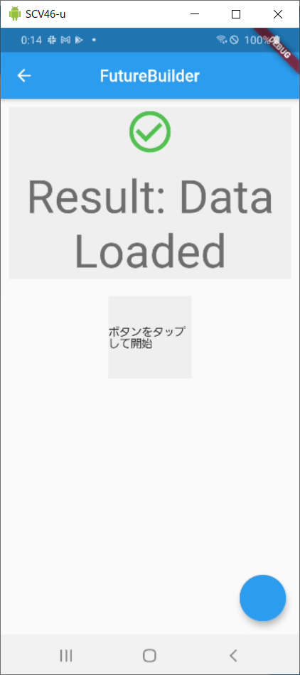
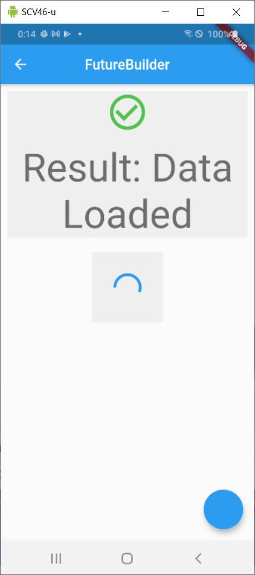
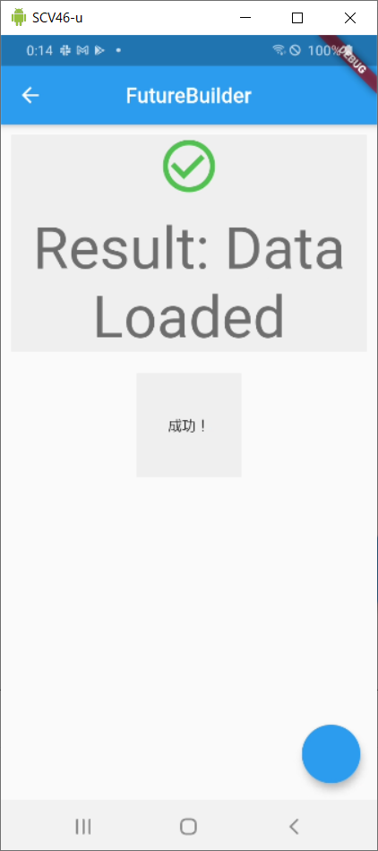

# #6 FutureBuilder

動画：https://www.youtube.com/watch?v=ek8ZPdWj4Qo

リファレンス：https://api.flutter.dev/flutter/widgets/FutureBuilder-class.html

## 何をする Widget か？

- 非同期での Widget ビルドができる
- future で現在状態を確認し、完了した時点で表示することができる

## 使い方

```dart
FutureBuilder(
  future: _loadData, // 接続する非同期処理
  builder: (BuildContext context, AsyncSnapshot<String> snapshot) {
    if (_loadData == null) return Text("ボタンをタップして開始");
    // ConnectionState.doneをチェックし、完了するまではインジケーター表示
    if (snapshot.connectionState != ConnectionState.done)
      return CircularProgressIndicator();

    // エラーとなった場合
    if (snapshot.hasError) {
      return Text(snapshot.error.toString());
    }
    // データが取得された場合
    if (snapshot.hasData) {
      return Text(snapshot.data);
    } else {
      return Text("データなし");
    }
  },
)
```

## サンプル









## 内部

継承：StatefulWidget
